# Защищенный API для работы с LLM через OpenRouter

Проект реализует серверное приложение на FastAPI, предоставляющее защищённый API для взаимодействия с большой языковой моделью (LLM) через сервис [OpenRouter](https://openrouter.ai). Предусмотрена аутентификация и авторизация пользователей с использованием JWT и хранение данных в базе SQLite.

## Требования к установке

* **Python** от 3.11;
* **uv** от 0.11;

## Установка

---

Распакуйте проект в удобную директорию. После выполнения требований введите в установленной директории:
```
uv init
```

---

Создайте виртуальное окружение:
```
uv venv
```
и активируйте его:
```
source .venv/bin/activate   # MacOS/Linux
.venv\Scripts\activate.bat  # Windows
```

---

Установите зависимости проекта:
```
uv pip install -r <(uv pip compile pyproject.toml)
```

---

После этого зарегистрируйтесь на сайте [openrouter.ai](https://openrouter.ai/) и получите ключ к API, который будет использоваться для взаимодействия с большой языковой моделью (LLM).

Создайте копию файла **.env.example** в той же директории и переименуйте её в **.env** (или просто переименуйте **.env.example** в **.env**).

Полученный ранее API-ключ необходимо вставить в файл **.env** в строку:
```
OPENROUTER_API_KEY=
```
после знака равенства, без кавычек.

---

После успешной установки можно начать пользоваться:
```
uv run uvicorn app.main:app --reload --host 0.0.0.0 --port 8000
```

## Использование

После запуска приложения перейдите по ссылке: [http://0.0.0.0:8000/docs](http://0.0.0.0:8000/docs). Вы увидите интерфейс, в котором доступна документация всех эндпоинтов и возможность их тестирования.

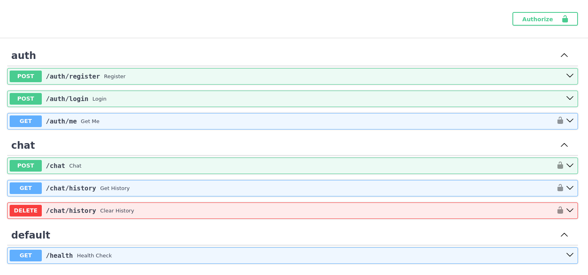

- Для взаимодействия с эндпоинтами откройте один из них и нажмите кнопку `Try it out`, после чего отредактируйте запрос и нажмите `Execute`.

Для полного доступа необходимо зарегистрировать пользователя и авторизоваться в приложении:

---

- **Регистрация нового пользователя**:

`POST /auth/register`

Откройте эндпоинт и отредактируйте запрос, замените значения на ваши. Ваши значения должны быть в кавычках.

`user@example.com` замените на ваш email в кавычках.

`stringst` замените на пароль от 8 до 16 символов.

**Пример**

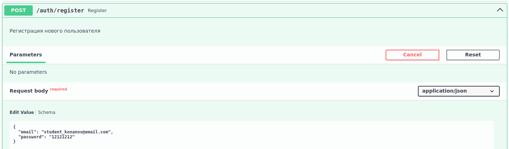

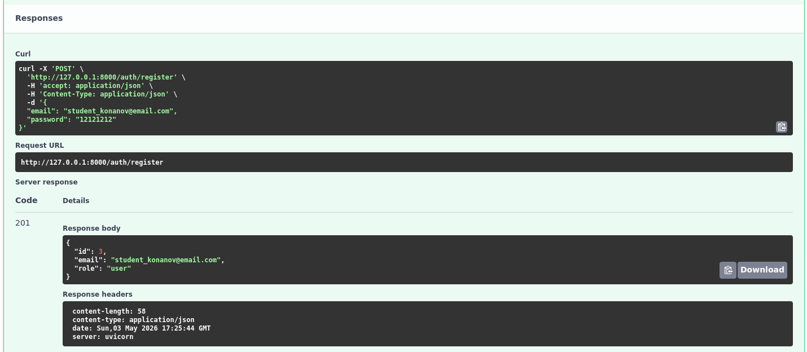

---

- **Вход по почте и паролю**:

`POST /auth/login`

Откройте эндпоинт и отредактируйте запрос. Замените только ***required** значения на те, которые вы вводили при регистрации.

**Обязательно** после запроса скопируйте значение **access_token** из поля ответа - это ваш ключ для авторизации.

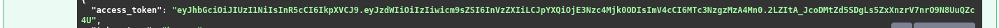

**Пример**

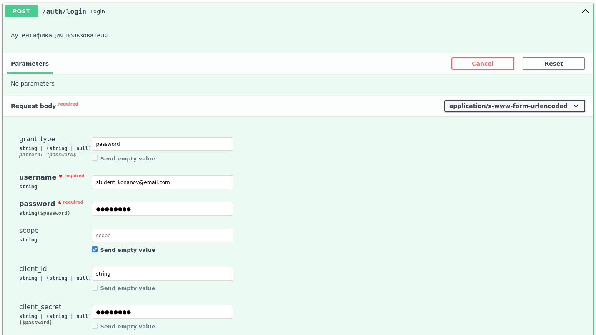

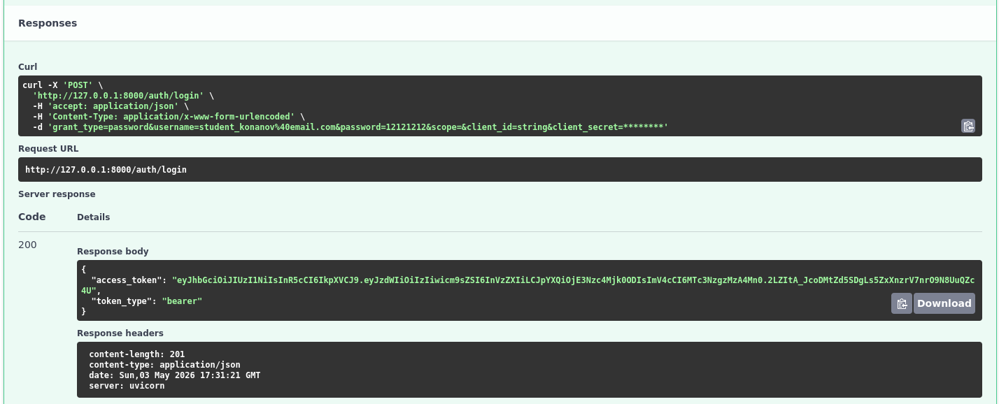

---

- **После входа необходимо также авторизоваться**:

Нажмите на кнопку сверху справа интерфейса.


Введите ваши данные в поля `username` и `password`, после чего вставьте ваш **access-токен** в поле `client_secret`.

**Пример**

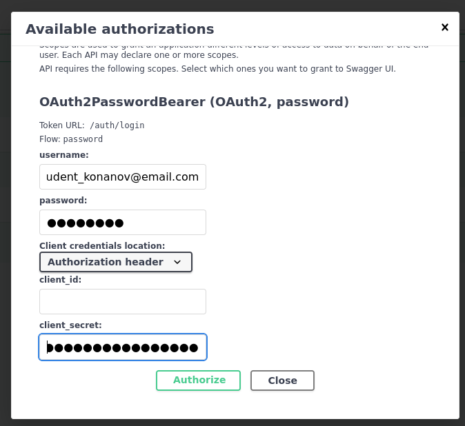

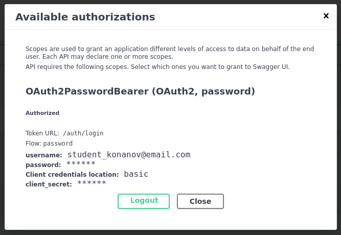

---

- **Проверка авторизации**:

`AUTH /auth/me`

Используйте, чтобы проверить, что вы авторизованы в системе.

**Пример**

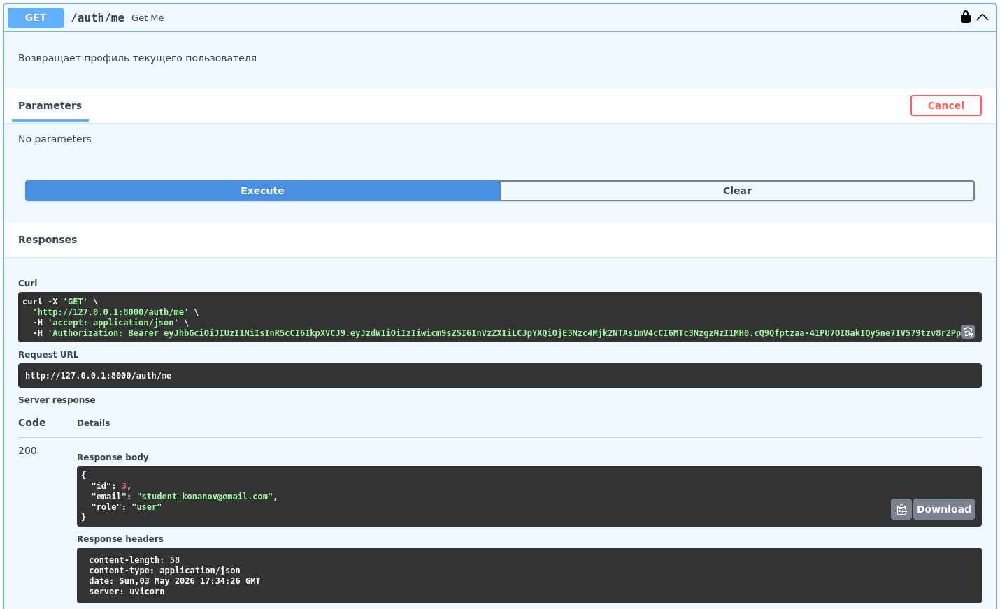

---

После успешной авторизации можно отправлять запросы модели:

---

- **Запрос модели**:

`POST /chat`

Откройте эндпоинт и отредактируйте запрос.

Замените значение `prompt` на вопрос, который вы хотите задать модели.

**Пример**

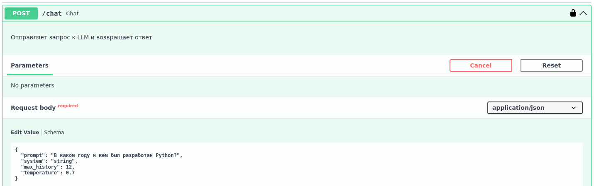

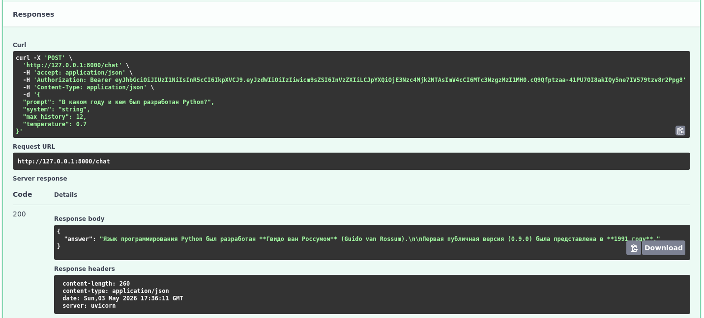

---

- **История запросов и ответов**:

`POST /chat/history`

Откройте эндпоинт и задайте значение `limit` - сколько последних сообщений вывести.

**Пример**

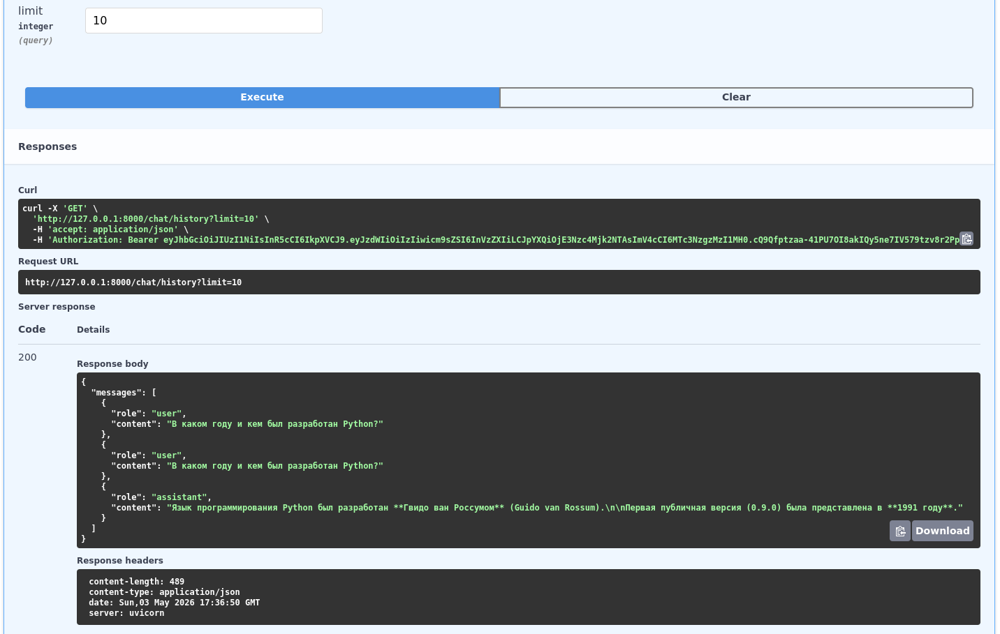

---

- **Удаление истории запросов и ответов**:

`DELETE /chat/history`

Выполните, чтобы полностью стереть историю сообщений.

**Пример**

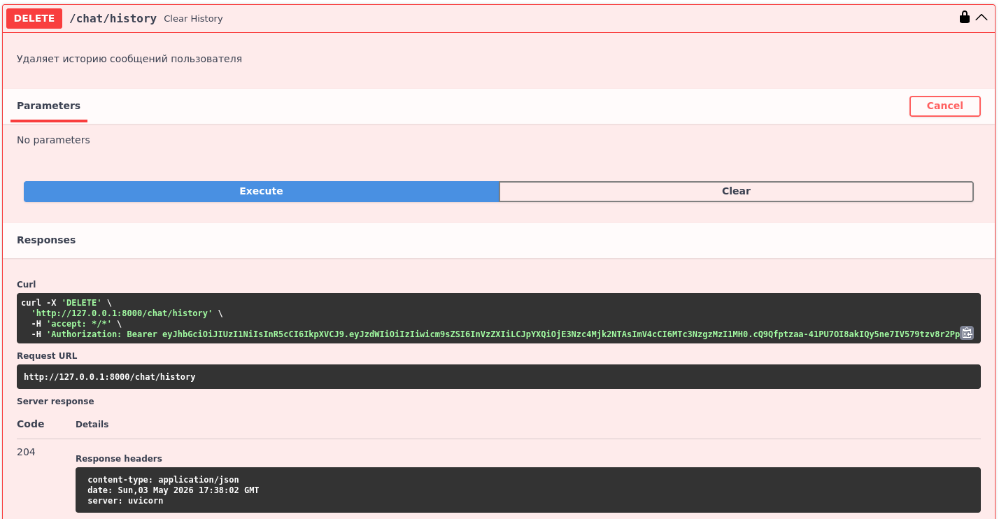

---

- **Статус приложения**:

`GET /health`

Выполните, чтобы проверить статус приложения.

**Пример**

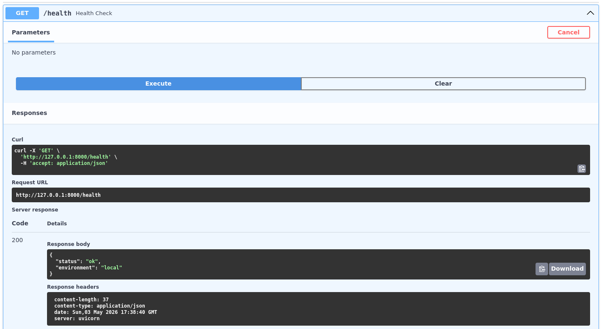
